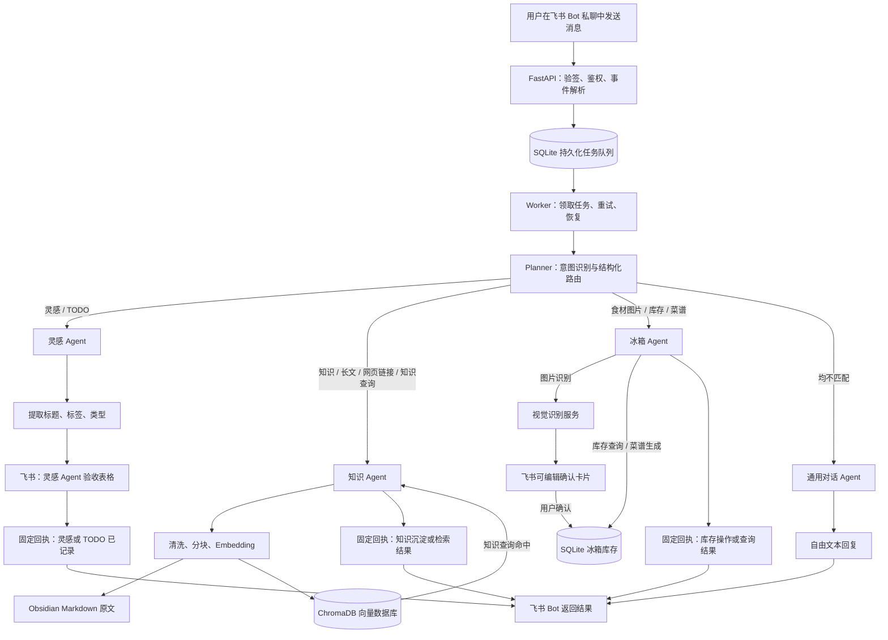
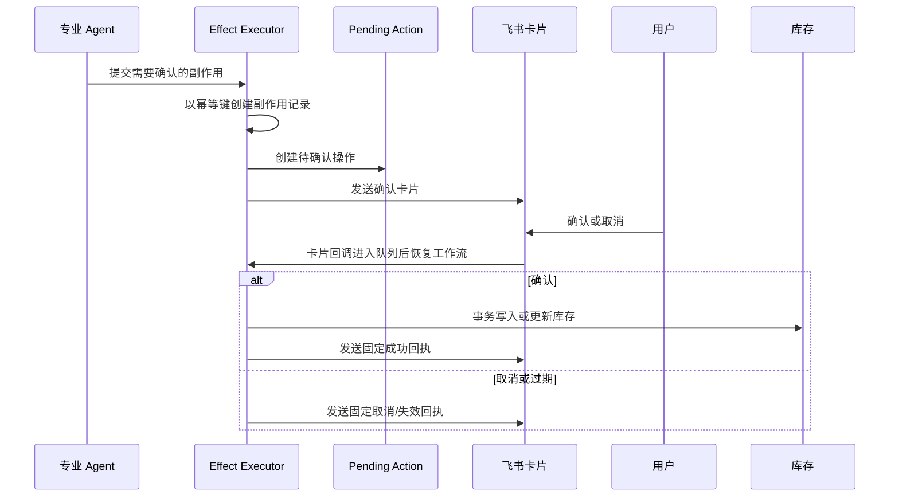

# 飞书 Bot 意图路由与 Agent 架构流程

本文档定义项目后续开发的目标架构：用户只通过飞书 Bot 私聊进入系统；Planner 完成意图识别并路由到唯一的专业 Agent。专业 Agent 完成明确的业务动作后返回固定格式的回执或结果，不参与通用闲聊。只有未命中已支持意图时，才由通用对话 Agent 生成自由文本。

## 1. 架构原则

1. **单一入口**：飞书 Bot 私聊是唯一用户入口；事件与卡片操作均先入持久化任务队列。
2. **先识别、再路由**：Planner 只负责识别意图和生成结构化路由结果，不直接执行外部操作。
3. **专业 Agent 职责收敛**：灵感、知识、冰箱 Agent 只调用各自白名单能力，并只输出约定的固定结果格式。
4. **通用对话兜底**：没有匹配到已支持意图时，才调用通用对话 Agent；它不得写入知识库、灵感表或库存。
5. **写入可审计**：所有外部写入都经过统一副作用执行器，并以幂等键防止重复执行；库存变更必须经过用户确认。

## 2. 总体流程

## 3. 路由契约

Planner 的输出必须是结构化数据，不允许直接生成面向用户的回答。初期采用互斥路由：一条消息只进入一个主 Agent；如未来支持复合意图，应在 Planner 层明确拆分任务和输出合并规则，不能由 Agent 自行转发。

| 路由 | 典型输入 | 执行方 | 允许写入 | 用户可见输出 |
| --- | --- | --- | --- | --- |
| `inspiration` | 灵感、点子、TODO、待办 | 灵感 Agent | 飞书灵感 Agent 验收表格 | 固定入表回执 |
| `knowledge_store` | 长文、收藏、网页链接、要求沉淀的内容 | 知识 Agent | Obsidian、ChromaDB | 固定沉淀回执 |
| `knowledge_query` | 检索既有知识、查找笔记 | 知识 Agent | 无 | 固定格式的命中结果与引用 |
| `fridge_ingest` | 食材图片 | 冰箱 Agent | 草稿、确认后的现有食材 | 食材名称确认卡片 |
| `fridge_query` | 查询现有食材 | 冰箱 Agent | 无 | 现有食材卡片 |
| `fridge_mutate` | 食材已经用完 | 冰箱 Agent | 确认后的现有食材 | 确认卡片与固定结果 |
| `recipe` | 根据现有食材推荐菜 | 冰箱 Agent | 无 | 已有食材、需补充食材和步骤 |
| `general_chat` | 以上均不匹配的普通对话 | 通用对话 Agent | 无 | 自由文本回复 |

## 4. 各 Agent 的职责与输出

### 4.1 灵感 Agent

- 输入：文本消息及其 `message_id`、发送时间、用户标识。
- 处理：提取标题、标签与类别（灵感或 TODO），构造验收表格记录。
- 写入：飞书“灵感 Agent 验收表格”，以 `message_id + task_id` 作为幂等键。
- 固定回执：`已记录{类型}：{标题}`；写入失败时为 `记录失败，请稍后重试。`

### 4.2 知识 Agent

- 输入：文本、网页链接或知识查询。
- 沉淀处理：安全抓取网页、清洗文本、生成标题与标签、保存 Markdown 原文、分块并写入 ChromaDB。
- 查询处理：用同一 Embedding 模型检索 ChromaDB，按相关度输出命中片段及来源引用。
- 固定回执：
  - 沉淀成功：`已沉淀 {document_count} 条知识，共 {chunk_count} 个索引片段。`
  - 查询成功：固定标题、命中列表、来源链接；不调用通用对话 Agent 改写答案。
  - 无命中：`知识库中没有找到相关内容。`

### 4.3 冰箱 Agent

- 输入：食材图片、库存操作指令或菜谱请求。
- 图片录入：下载图片 → 视觉服务识别 → 保存草稿 → 发送可编辑确认卡片 → 用户确认后事务写入库存。
- 库存变更：修改、消耗和删除均创建待确认操作；确认前不得更改库存。
- 查询与菜谱：读取库存并返回库存卡片或固定结构的菜谱结果；生成菜谱不自动扣减库存。
- 固定回执：
  - 识别完成：`图片识别完成，请确认后入库。`
  - 写入完成：`已将 {count} 种食材写入库存。`
  - 操作取消：`操作已取消。`
  - 查询结果：库存卡片；菜谱结果：标题、库存食材、需补充食材、步骤。

### 4.4 通用对话 Agent

- 仅在 Planner 输出 `general_chat` 时运行。
- 可以生成自由文本对话回复，但没有数据库、飞书表格、库存或文件写入权限。
- 如果用户请求敏感或高风险操作，应返回说明或引导，而不是执行副作用。

## 5. 确认与幂等流程

## 6. 实施约束

- 为 `Intent` 增加 `general_chat`，并新增 `TaskKind.GENERAL`（或等价路由类型）。
- 将现有 `PlaceholderAgent` 替换为 `GeneralChatAgent`；不要将普通对话写入 `unhandled_intents`。
- 移除知识 Agent 与冰箱 Agent 中面向闲聊的自由生成出口；查询和菜谱使用模板渲染结构化结果。
- 所有固定回执集中定义为模板或常量，便于统一文案、测试和国际化。
- 任何可能写入库存的分支必须保持“先卡片确认、再执行”的顺序。
- 为 Planner 路由、固定回执、确认幂等和通用对话无副作用分别补充单元测试与端到端测试。

## 7. 建议的开发顺序

1. 扩展意图枚举和 Planner 路由规则，接入 `general_chat`。
2. 实现 `GeneralChatAgent`，并限制其只有文本生成能力。
3. 将灵感、知识、冰箱 Agent 的回复收敛为固定模板。
4. 调整工作流分发与聚合逻辑，确保每条消息按唯一主路由处理。
5. 补齐路由、确认、幂等与无副作用的测试。
