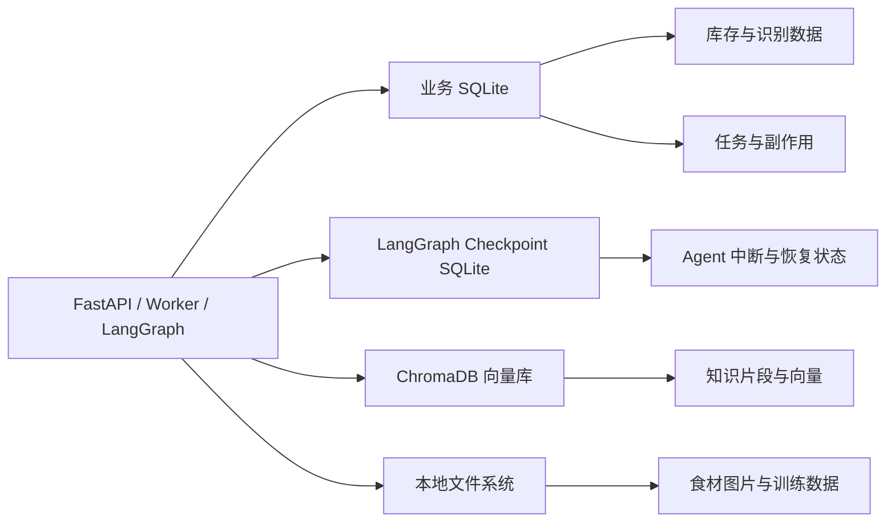
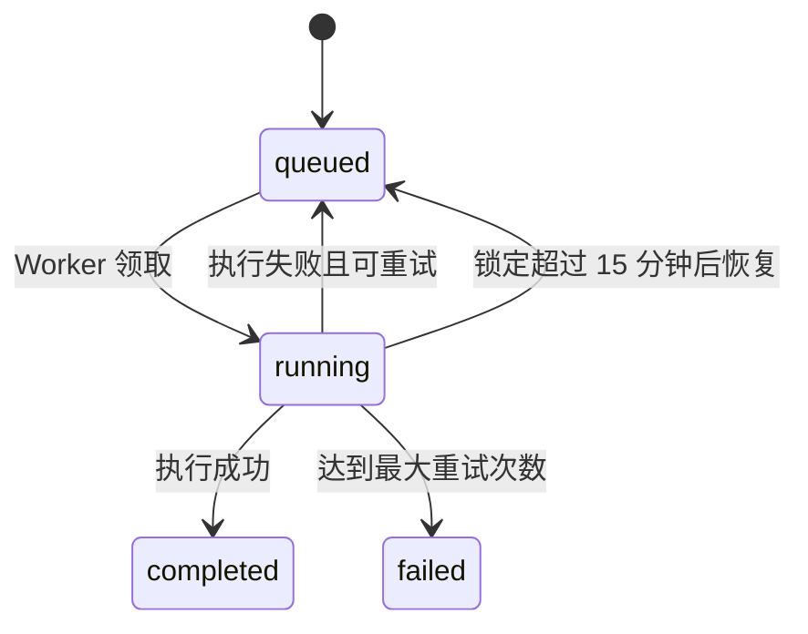
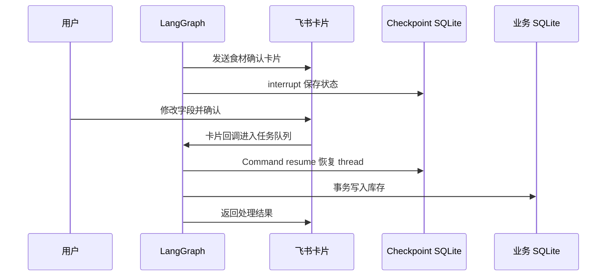
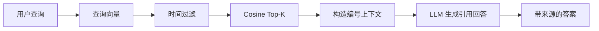
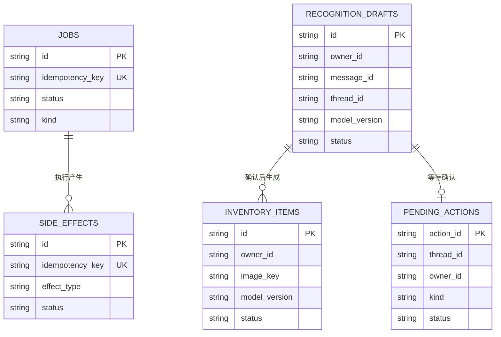

# self-evolution-Agent 数据库与向量库设计

本文档说明 `self-evolution-Agent` 当前已经实现的数据库、向量库、数据关系、读写流程，以及正式长期使用前建议补齐的设计。

> Embedding 模型必须由项目所有者决定。本文出现的 `BAAI/bge-small-zh-v1.5` 仅表示当前代码默认占位，不代表最终选型。

## 1. 持久化架构概览

项目目前使用三类持久化存储：

1. **业务 SQLite**：库存、任务、识别草稿、待确认动作、副作用记录和未识别需求。
2. **LangGraph Checkpoint SQLite**：保存 Agent 图执行状态、中断信息及恢复上下文。
3. **ChromaDB**：保存知识片段、Embedding 向量和来源元数据。

食材图片和训练文件保存在本地文件系统，不直接存入数据库。



默认存储位置：

| 存储 | 默认路径 |
| --- | --- |
| 业务 SQLite | `data/self_evolution.db` |
| LangGraph Checkpoint | `data/langgraph_checkpoints.db` |
| ChromaDB | `data/chroma` |
| 食材图片 | `data/images` |
| 训练数据 | `data/training` |

相关配置：

```env
DATA_DIR=./data
DATABASE_URL=sqlite+aiosqlite:///./data/self_evolution.db
CHROMA_PATH=./data/chroma
```

## 2. 业务数据库

### 2.1 技术实现

业务数据库当前使用：

- SQLite
- SQLAlchemy 2.x ORM
- `aiosqlite` 异步驱动
- UUID 字符串主键
- Repository 模式
- SQLite WAL 模式
- 应用启动时通过 `Base.metadata.create_all()` 创建表

代码位置：

- `src/self_evolution_agent/db.py`
- `src/self_evolution_agent/repositories.py`

当前 SQLite 设计适用于：

- 单用户
- 单 Worker
- 本机或单机部署
- 中低频任务
- 个人知识和冰箱库存规模

### 2.2 `jobs` 持久任务队列

`jobs` 用于保存飞书消息和卡片回调任务。

| 字段 | 类型 | 说明 |
| --- | --- | --- |
| `id` | UUID string | 主键 |
| `kind` | string | `message` 或 `card_action` |
| `payload_json` | text | 标准化消息或卡片动作 |
| `status` | string | `queued/running/completed/failed` |
| `attempts` | integer | 已执行次数 |
| `max_attempts` | integer | 最大执行次数，默认 5 |
| `available_at` | datetime | 下次允许领取任务的时间 |
| `locked_at` | datetime | Worker 领取任务的时间 |
| `last_error` | text | 最近一次错误 |
| `idempotency_key` | string | 唯一幂等键 |
| `created_at` | datetime | 创建时间 |
| `updated_at` | datetime | 更新时间 |

任务状态流转：



失败任务使用指数退避：

```text
delay = min(300, 2^(attempts-1)) 秒
```

事件幂等键示例：

```text
feishu-event:<event_id>
card:<action_id>:<action>
```

### 2.3 `processed_events` 事件记录

`processed_events` 是飞书事件去重的预留表。

| 字段 | 说明 |
| --- | --- |
| `event_id` | 飞书事件 ID，主键 |
| `received_at` | 接收时间 |

当前主链路主要通过 `jobs.idempotency_key` 去重，这张表暂未成为核心流程的一部分。

后续应该二选一：

- 只使用 `jobs.idempotency_key`；或
- 使用 `processed_events` 记录接收状态，再由 Job 保存执行状态。

不建议长期维持职责重叠的两套去重逻辑。

### 2.4 `inventory_items` 冰箱库存

| 字段 | 类型 | 说明 |
| --- | --- | --- |
| `id` | UUID string | 库存主键 |
| `owner_id` | string | 飞书用户 open_id |
| `name` | string | 食材展示名称 |
| `normalized_name` | string | 标准化食材名称 |
| `quantity` | float | 数量 |
| `unit` | string | 单位，默认 `件` |
| `production_date` | date | 生产日期，可为空 |
| `expiry_date` | date | 到期日，可为空 |
| `date_source` | string | `printed/calculated/unknown` |
| `image_key` | string | 来源飞书图片 key |
| `status` | string | `active/consumed/deleted` |
| `model_version` | string | 视觉模型版本 |
| `created_at` | datetime | 创建时间 |
| `updated_at` | datetime | 更新时间 |

库存采用软删除：

- `active`：当前有效库存。
- `consumed`：已经消耗。
- `deleted`：用户删除。

当前临期查询条件：

```text
owner_id = 当前用户
status = active
expiry_date 不为空
expiry_date <= 今天 + 3 天
```

当前设计保留 `owner_id`，虽然第一版是单用户，但未来可以扩展到多用户数据隔离。

### 2.5 `recognition_drafts` 视觉识别草稿

| 字段 | 类型 | 说明 |
| --- | --- | --- |
| `id` | UUID string | 草稿主键 |
| `owner_id` | string | 所属用户 |
| `message_id` | string | 来源飞书消息 ID |
| `thread_id` | string | LangGraph thread ID |
| `image_key` | string | 飞书图片 key |
| `image_path` | text | 本地图片路径 |
| `prediction_json` | text | 模型原始预测 |
| `corrected_json` | text | 用户确认或修正后的结果 |
| `model_version` | string | 视觉模型版本 |
| `status` | string | `pending/confirmed` |
| `created_at` | datetime | 创建时间 |
| `updated_at` | datetime | 更新时间 |

该表支持完整的数据闭环：

```text
图片 → 模型预测 → 用户修正 → 确认入库 → 导出训练样本
```

它同时承担：

- 识别审计记录
- 用户确认前的临时数据
- 原始预测与人工修正对比
- 微调数据来源
- 模型版本追踪

### 2.6 `pending_actions` 待确认动作

| 字段 | 类型 | 说明 |
| --- | --- | --- |
| `action_id` | UUID string | 动作主键 |
| `thread_id` | string | LangGraph thread ID |
| `owner_id` | string | 允许操作的用户 |
| `kind` | string | 食材确认或库存修改类型 |
| `payload_json` | text | 待确认数据 |
| `status` | string | 动作状态 |
| `expires_at` | datetime | 动作过期时间 |
| `created_at` | datetime | 创建时间 |
| `updated_at` | datetime | 更新时间 |

默认有效期为 24 小时。

执行动作时校验：

- `action_id` 存在
- `owner_id` 与当前飞书用户一致
- 状态为 `pending`
- `expires_at` 尚未过期

典型状态：

```text
pending → processing → completed
pending → processing → pending      # 校验失败，可重新修正
pending → cancelled
```

### 2.7 `side_effects` 外部副作用账本

| 字段 | 类型 | 说明 |
| --- | --- | --- |
| `id` | UUID string | 主键 |
| `idempotency_key` | string | 唯一幂等键 |
| `effect_type` | string | 副作用类型 |
| `status` | string | `pending/completed/failed` |
| `response_json` | text | 外部服务响应 |
| `error` | text | 错误信息 |
| `created_at` | datetime | 创建时间 |
| `updated_at` | datetime | 更新时间 |

副作用包括：

- 写入飞书多维表格
- 发送飞书文本消息
- 发送飞书交互卡片
- 准备食材确认动作
- 准备库存修改动作

唯一 `idempotency_key` 避免飞书重试或 Worker 重试造成重复外部操作。

### 2.8 `unhandled_intents` 未支持需求

| 字段 | 类型 | 说明 |
| --- | --- | --- |
| `id` | UUID string | 主键 |
| `owner_id` | string | 用户 open_id |
| `message_id` | string | 飞书消息 ID |
| `raw_request` | text | 用户原始请求 |
| `planner_intent` | string | Planner 判断结果 |
| `created_at` | datetime | 创建时间 |

该表用于积累未来 Agent 的真实需求，例如：

- 记账 Agent
- 健康 Agent
- 日程 Agent
- 其他无法匹配的生活流

Placeholder Agent 即使记录失败，也不会阻塞用户收到兜底回复。

## 3. LangGraph Checkpoint 数据库

默认路径：

```text
data/langgraph_checkpoints.db
```

该数据库由 `AsyncSqliteSaver` 管理，不保存业务库存，而是保存 Agent 图执行状态。

主要内容包括：

- Graph State
- 当前执行节点
- Planner 计划
- 并行 Agent 结果
- 待执行副作用
- interrupt 信息
- resume 数据
- `thread_id` 对应的执行历史

食材确认流程：



业务数据库与 checkpoint 分离的优点：

- 业务数据可以独立备份
- LangGraph 内部结构不会污染业务表
- Agent 状态升级不直接影响库存表
- 可以独立清理过期 checkpoint
- 更容易迁移业务数据库

## 4. ChromaDB 向量库

### 4.1 基本配置

默认路径：

```env
CHROMA_PATH=./data/chroma
```

当前 Collection：

```text
personal_knowledge
```

当前距离空间：

```text
HNSW cosine
```

代码位置：

```text
src/self_evolution_agent/rag.py
```

### 4.2 知识入库流程


具体步骤：

1. 接收飞书文本或抓取网页正文。
2. 移除多余空格和连续空行。
3. 网页内容移除脚本、样式、导航和页脚。
4. 提取标题、标签和来源。
5. 对正文进行分块。
6. 使用项目所有者决定的 Embedding 模型生成向量。
7. 对向量进行归一化。
8. 将文本、向量和元数据写入 ChromaDB。

### 4.3 分块设计

当前默认参数：

```text
目标分块大小：650 个字符
分块重叠：80 个字符
```

优先使用以下边界：

```text
。！？；和换行
```

分块 ID 格式：

```text
<document_id>:<chunk_index>
```

例如：

```text
6c9551f7-...:0
6c9551f7-...:1
6c9551f7-...:2
```

同一个 `document_id` 表示片段属于同一篇原始知识。

### 4.4 向量与元数据

每个 Chroma 记录包含：

| 内容 | 说明 |
| --- | --- |
| `id` | `{document_id}:{chunk_index}` |
| `document` | 分块后的文本 |
| `embedding` | 归一化向量 |
| `document_id` | 原始知识 ID |
| `title` | 知识标题 |
| `tags` | 逗号分隔标签 |
| `source` | 飞书 message_id 或网页 URL |
| `created_at` | ISO 时间字符串 |
| `created_ts` | 数值时间戳 |

`created_at` 用于展示和引用。

`created_ts` 用于 Chroma 数值型时间过滤。

### 4.5 Embedding

Embedding 模型通过环境变量配置：

```env
EMBEDDING_MODEL=
```

当前实现方式：

- 使用 `sentence-transformers`
- 本地 CPU 推理
- 文档向量归一化
- 查询向量归一化
- 使用余弦相似度

当前代码默认占位：

```env
EMBEDDING_MODEL=BAAI/bge-small-zh-v1.5
```

最终模型必须由项目所有者决定。

如果最终选择远程 Embedding API，需要增加独立的 Embedding Provider，目前代码只实现了本地 `SentenceTransformer`。

### 4.6 查询流程



当前默认召回数量：

```env
KNOWLEDGE_TOP_K=5
```

时间过滤条件：

```text
created_ts >= start_at.timestamp()
created_ts <= end_at.timestamp()
```

相似度转换：

```text
similarity_score = 1 - cosine_distance
```

检索结果返回：

- 片段正文
- 标题
- 来源
- 创建时间
- 相似度分数

RAG 回答要求在关键结论后使用 `[1]`、`[2]` 等编号引用来源。

如果 Chat 模型不可用，系统退化为相关标题和来源列表。

## 5. 业务数据关系

当前数据库没有显式外键，主要通过逻辑 ID 建立关联。



当前逻辑关系：

- 飞书消息通过 `message_id` 对应任务和识别草稿。
- LangGraph 通过 `thread_id` 对应 pending action 和 checkpoint。
- 识别草稿确认后生成一条或多条库存记录。
- `owner_id` 用于限制数据访问和卡片动作。
- `model_version` 用于追踪视觉预测来源。
- Job 和 SideEffect 分别负责任务幂等和外部操作幂等。

## 6. 典型数据流

### 6.1 飞书事件进入任务队列

```text
飞书事件
  → 校验 token、签名、chat_type 和 open_id
  → 使用 event_id 构造 idempotency_key
  → 写入 jobs
  → API 立即返回
  → Worker 异步领取任务
```

### 6.2 食材照片入库

```text
飞书图片
  → jobs
  → Worker 下载到 data/images
  → Vision 服务识别
  → recognition_drafts.prediction_json
  → pending_actions
  → LangGraph interrupt
  → 用户修改并确认
  → recognition_drafts.corrected_json
  → inventory_items
```

### 6.3 灵感写入

```text
飞书文本
  → Planner
  → Inspiration Agent
  → BitableIdea
  → side_effects 幂等登记
  → 飞书 Bitable
```

灵感数据不存入本地业务数据库，最终存储在飞书多维表格。本地只保存副作用执行记录。

### 6.4 知识写入

```text
飞书文本或网页
  → 清洗
  → 标题和标签
  → Chunking
  → Embedding
  → ChromaDB
```

当前原始知识目录没有单独保存在 SQLite 中，因此整篇文档的列表、更新和删除能力仍需补齐。

## 7. 当前方案适用范围

SQLite + ChromaDB 适合当前项目，因为当前目标是：

- 单用户
- 单 Worker
- 单机运行
- 本地数据优先
- 中小规模知识库
- 低维护成本

当前阶段没有必要因为未来可能扩展而立即引入 PostgreSQL、Redis 和分布式向量数据库。

## 8. 扩展时的存储升级方向

如果未来需要多人、多 Worker 或云端高可用，可以考虑：

| 当前方案 | 扩展方案 | 触发条件 |
| --- | --- | --- |
| SQLite 业务数据库 | PostgreSQL | 多用户、并发写入、云端高可用 |
| SQLite Job Queue | Redis、RabbitMQ 或专业任务队列 | 多 Worker、任务吞吐提升 |
| 本地 ChromaDB | Chroma Server、Qdrant、Milvus、pgvector | 大规模向量、多节点访问 |
| 本地图片文件 | S3、MinIO 或云对象存储 | 多设备、云端训练、备份 |
| 本地 checkpoint | PostgreSQL/Redis Checkpointer | 多实例 LangGraph |

迁移前应先通过指标证明当前存储成为瓶颈，不建议提前增加分布式复杂度。

## 9. 正式使用前需要补齐

### 9.1 数据库迁移

- [ ] 引入 Alembic
- [ ] 创建初始数据库迁移
- [ ] 停止依赖生产环境中的 `create_all()` 进行结构升级
- [ ] 建立数据库版本回滚流程
- [ ] 测试旧数据库升级

### 9.2 约束与关系

- [ ] 为状态字段定义 Enum 或 Check Constraint
- [ ] 为库存增加 `source_draft_id`
- [ ] 为库存和草稿增加明确逻辑关系
- [ ] 统一 `processed_events` 与 Job 幂等职责
- [ ] 为常用查询检查复合索引
- [ ] 确定是否启用数据库外键
- [ ] 增加数据一致性测试

### 9.3 知识目录

建议增加业务表：

```text
knowledge_documents
```

推荐字段：

| 字段 | 说明 |
| --- | --- |
| `id` | 与 Chroma `document_id` 相同 |
| `owner_id` | 数据所属用户 |
| `title` | 文档标题 |
| `source_type` | `feishu/url` |
| `source` | message_id 或 URL |
| `content_hash` | 内容去重 |
| `embedding_model` | 入库使用的模型 |
| `embedding_dimension` | 向量维度 |
| `collection_name` | Chroma Collection |
| `chunk_count` | 分块数量 |
| `status` | `active/deleted/reindexing/failed` |
| `created_at` | 创建时间 |
| `updated_at` | 更新时间 |

增加该表后可以实现：

- 列出知识文档
- 删除整篇知识及其全部向量
- 更新网页知识
- 内容 hash 去重
- 重新分块和重新索引
- 跟踪 Embedding 模型和版本
- 跟踪入库失败状态

### 9.4 Embedding 模型变更

不同 Embedding 模型产生的向量不能直接混入同一个 Collection。

模型变更时必须：

- [ ] 记录模型名称
- [ ] 记录模型版本
- [ ] 记录向量维度
- [ ] 记录是否归一化
- [ ] 创建新 Collection 或清空旧 Collection
- [ ] 对全部知识重新生成向量
- [ ] 在切换前运行检索评测
- [ ] 保留旧 Collection 直到验证完成
- [ ] 准备回滚方案

推荐 Collection 命名格式：

```text
personal_knowledge_<embedding_model>_<version>
```

最终名称需要在项目所有者确定 Embedding 模型后再固定。

### 9.5 备份与恢复

- [ ] 备份 `data/self_evolution.db`
- [ ] 备份 `data/langgraph_checkpoints.db`
- [ ] 备份 `data/chroma`
- [ ] 备份 `data/images`
- [ ] 确定训练数据保留策略
- [ ] 定期执行恢复演练
- [ ] 验证 SQLite WAL 文件的一致性备份方式
- [ ] 记录备份版本对应的应用版本和模型版本

### 9.6 数据生命周期

- [ ] 定义已完成 Job 的保留期限
- [ ] 定义失败 Job 的保留期限
- [ ] 定义过期 pending action 的清理任务
- [ ] 定义 checkpoint 清理策略
- [ ] 定义识别图片保留期限
- [ ] 定义 recognition draft 保留期限
- [ ] 定义 side effect 日志保留期限
- [ ] 定义软删除库存的清理或归档策略
- [ ] 定义知识删除策略

## 10. 推荐下一步

1. 由项目所有者确定最终 Embedding 模型。
2. 增加 `knowledge_documents` 业务表。
3. 根据最终 Embedding 模型确定 Collection 命名和版本策略。
4. 引入 Alembic 并生成第一版迁移。
5. 为库存增加 `source_draft_id`。
6. 统一事件去重机制。
7. 编写数据库备份和恢复脚本。
8. 使用真实飞书消息完成 SQLite 和 ChromaDB 端到端验收。
