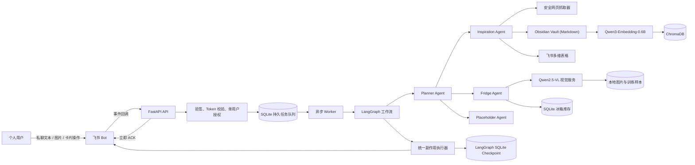
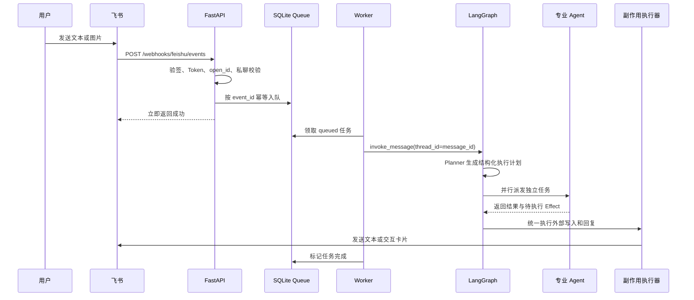
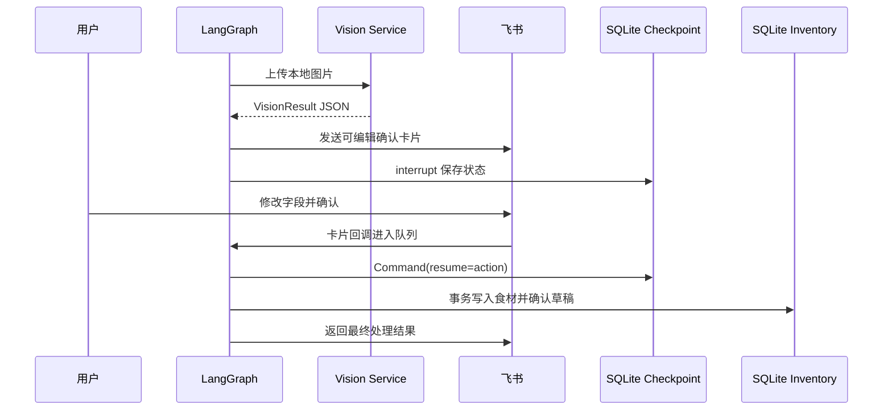
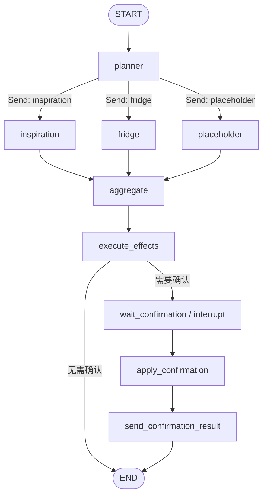

# self-evolution-Agent

`self-evolution-Agent` 是一个以飞书 Bot 私聊为唯一交互入口的个人智能中枢。

项目基于 FastAPI、LangGraph、SQLite 和 ChromaDB 构建，当前聚焦两个可形成数据闭环的生活场景：

1. **数字资产沉淀**：识别知识、灵感和 TODO，将知识写入本地向量库，将灵感写入飞书多维表格，并支持带来源引用的知识检索问答。
2. **冰箱助手**：通过本地视觉模型识别食材，经用户确认后维护极简的现有食材清单，并根据清单推荐菜。

本项目不是通用聊天机器人。无法匹配现有能力的请求会由 Placeholder Agent 记录，作为后续扩展记账、健康等专业 Agent 的需求依据。

## 目录

- [核心能力](#核心能力)
- [系统架构](#系统架构)
- [消息处理流程](#消息处理流程)
- [LangGraph 工作流](#langgraph-工作流)
- [Agent 职责](#agent-职责)
- [数据架构](#数据架构)
- [RAG 策略](#rag-策略)
- [视觉模型与微调](#视觉模型与微调)
- [技术栈](#技术栈)
- [项目结构](#项目结构)
- [快速开始](#快速开始)
- [飞书应用配置](#飞书应用配置)
- [环境变量](#环境变量)
- [启动方式](#启动方式)
- [API 接口](#api-接口)
- [测试与质量](#测试与质量)
- [安全与可靠性](#安全与可靠性)
- [当前限制](#当前限制)

## 核心能力

### 数字资产

- 识别飞书文本中的知识、长文、网页链接、灵感和 TODO。
- 网页抓取支持正文清洗、重定向限制、响应体积限制和 SSRF 防护。
- 知识按约 650 个字符分块，默认重叠 80 个字符。
- 使用 `Qwen/Qwen3-Embedding-0.6B` 在 CPU 上生成多语言向量；查询侧使用模型内置的 `query` prompt。
- 知识原文先写入 Obsidian Vault 的 Markdown 文件，再由 ChromaDB 持久化片段、向量及 Obsidian 文件链接。
- 支持语义召回、时间范围过滤以及带 `[序号]` 来源引用的生成式回答。
- 灵感/TODO 结构化后幂等写入已有飞书多维表格。

### 冰箱资产

- 从飞书图片消息下载食材照片，调用独立视觉服务识别食材名称。
- 识别结果通过飞书交互卡片展示；用户可修改名称或清空误识别条目。
- 用户确认后，将食材写入 SQLite 的“现有食材”清单；同名食材自动合并。
- 支持查看现有食材和将已用完的食材移出清单。
- 根据现有食材推荐简单菜品，并区分已有食材与需要补充的辅料。
- 不识别数量、包装日期、保质期或临期状态；菜品推荐不会自动修改清单。

### 工程能力

- 飞书事件立即确认，耗时任务进入 SQLite 持久队列异步执行。
- 重复飞书事件、重复卡片点击和外部副作用均有幂等保护。
- 失败任务使用指数退避重试，进程重启后可恢复长时间未完成的任务。
- LangGraph 使用 SQLite checkpoint 保存中断状态。
- 需要用户确认的图执行通过 `interrupt` 暂停，再由卡片回调恢复。
- 仅允许配置的飞书 `open_id` 使用，且仅接受 Bot 私聊消息。

## 系统架构



### 运行进程

Docker Compose 定义三个服务：

| 服务 | 默认端口 | 主要职责 |
| --- | ---: | --- |
| `api` | `8000` | 接收飞书事件和卡片回调、鉴权、入队、健康检查 |
| `worker` | 无 | 消费持久任务、下载图片、运行 LangGraph、执行副作用 |
| `vision` | `8001` | 懒加载本地 Qwen2.5-VL，提供严格 JSON 的图片识别接口 |

`api` 与 `worker` 使用同一个应用镜像。`vision` 使用带 CUDA Runtime 的独立镜像，避免主服务安装 GPU 推理依赖。

## 消息处理流程

### 普通消息



### 食材确认与图恢复



## LangGraph 工作流

工作流位于 `src/self_evolution_agent/workflow.py`，主要节点如下：



### Graph State

图状态包含：

| 字段 | 作用 |
| --- | --- |
| `message` | 标准化后的飞书消息、图片和 URL |
| `thread_id` | LangGraph checkpoint 标识，消息任务使用飞书 `message_id` |
| `plan` | Planner 生成的 `ExecutionPlan` |
| `task` | 动态派发给专业 Agent 的单个任务 |
| `results` | 并行 Agent 结果，使用 reducer 合并 |
| `effects` | 待统一执行的消息、Bitable 或库存副作用 |
| `reply` | 聚合后的用户可读回复 |
| `pending_confirmation` | 需要卡片确认的动作信息 |
| `confirmation_result` | 恢复执行后的最终结果 |

### Plan-and-Execute

Planner 使用严格结构化输出生成：

- `intent`：主要意图。
- `tasks`：可执行任务列表。
- `dependencies`：任务依赖标识。
- `requires_confirmation`：是否涉及需要确认的副作用。
- `rationale`：简要路由依据。

模型计划会在派发前校验任务 ID、intent 与 Agent 类型匹配、确认要求，以及图片录入约束。当前工作流仅并行执行独立任务，因此包含 `dependencies` 的模型计划会被拒绝并回退到本地规则路由。模型调用失败、模型未配置或结构化结果无效时，同样会回退，保证基础意图仍可识别。

当前支持的意图：

| Intent | Agent | 说明 |
| --- | --- | --- |
| `knowledge_store` | Inspiration | 保存知识文本或网页正文 |
| `knowledge_query` | Inspiration | 查询知识库并生成带引用回答 |
| `inspiration` | Inspiration | 整理灵感或 TODO，准备写入 Bitable |
| `fridge_ingest` | Fridge | 识别图片并发起确认 |
| `fridge_query` | Fridge | 查看现有食材清单 |
| `fridge_mutate` | Fridge | 将食材标记为已用完 |
| `recipe` | Fridge | 根据库存生成菜谱 |
| `placeholder` | Placeholder | 记录未支持需求并返回能力边界 |

## Agent 职责

### Planner Agent

- 接收标准化文本、图片数量和 URL。
- 使用 OpenAI-compatible 模型输出 `ExecutionPlan`。
- 将多个独立意图拆成任务，通过 LangGraph `Send` 并行派发。
- 图片录入和库存变更自动标记为需要确认。

### Inspiration Agent

工具边界限定在知识与灵感领域：

- 提取内容标题、标签和内容类型。
- 抓取并清洗公开网页。
- 知识分块、Embedding、ChromaDB 写入和检索。
- 基于检索片段生成引用式回答。
- 生成 `BitableIdea`，由副作用层写入多维表格。

### Fridge Agent

工具边界限定在视觉、库存和菜谱领域：

- 调用独立 `VisionProvider` 识别图片。
- 保存识别草稿和模型原始输出。
- 由用户确认或修正食材名称后更新现有食材清单。
- 查询现有食材，或从自然语言提取“已用完”的食材名称。
- 根据现有食材生成结构化菜品推荐。
- 所有写操作交由确认和副作用层执行。

### Placeholder Agent

- 处理当前能力范围以外的请求。
- 将用户原始请求、Planner 意图和时间写入 `unhandled_intents`。
- 即使记录失败，也不会阻塞用户收到兜底回复。

### 关于 ReAct

专业 Agent 采用“受限工具、观察结果、再生成输出”的 ReAct 风格边界，但当前 MVP 在代码中使用明确的 Intent 分支调用白名单能力，而不是开放式无限工具循环。这一设计优先保证副作用可审计、可测试和可确认。

## 数据架构

### SQLite

应用数据库默认位于 `data/self_evolution.db`，启用 WAL 模式。

| 表 | 作用 | 关键数据 |
| --- | --- | --- |
| `jobs` | 持久任务队列 | 状态、尝试次数、下次执行时间、错误、幂等键 |
| `processed_events` | 事件去重扩展位 | 飞书事件 ID、接收时间 |
| `inventory_items` | 现有食材 | 食材名称、状态、来源图片、模型版本 |
| `recognition_drafts` | 视觉识别草稿 | 原始预测、用户修正、图片路径、确认状态 |
| `pending_actions` | 待确认操作 | 动作类型、payload、用户、过期时间、状态 |
| `side_effects` | 外部副作用账本 | 幂等键、类型、状态、响应、错误 |
| `unhandled_intents` | 未支持需求池 | 原始请求、Planner 意图、用户、时间 |

食材清单不执行物理删除：

- `active`：当前已有。
- `consumed`：已经用完。

### ChromaDB

知识原文保存于 Obsidian Vault（默认 `data/obsidian-vault`），每个文件包含标题、标签、创建时间和原始来源的 YAML frontmatter。Chroma 仅作为可重建检索索引，保存片段、向量、来源以及 `obsidian://` 文件链接；RAG 回复会附带对应 Markdown 文件链接。

集合名由 Embedding 模型派生，当前为 `personal_knowledge_qwen_qwen3_embedding_0_6b`，持久化目录是 `data/chroma`。更换模型会创建一个新集合，旧集合不会被删除；需要从 Obsidian Vault 重新入库后才能用新模型检索已有知识。

每个向量片段保存：

- `document_id`
- `chunk_id`
- `title`
- `tags`
- `source`
- `created_at`
- `created_ts`
- 原始片段文本

`created_ts` 用于数值型时间过滤，`created_at` 用于展示和引用。

### 本地文件

| 路径 | 内容 |
| --- | --- |
| `data/images` | 从飞书下载的食材图片 |
| `data/training` | 导出的确认样本及评测数据 |
| `data/langgraph_checkpoints.db` | LangGraph checkpoint |
| `models` | Docker 视觉服务的 Hugging Face 模型缓存 |

这些目录已被 `.gitignore` 排除，默认不会提交用户数据、模型或密钥。

## RAG 策略

### 快速测试 Embedding

当前默认 Embedding 模型是 `Qwen/Qwen3-Embedding-0.6B`，在 CPU 上通过
`sentence-transformers` 运行。可执行以下命令查看向量维度和中文语义相似度排名：

```powershell
.\.venv\Scripts\python.exe scripts/test_embedding.py
```

也可以传入自己的查询和候选文本：

```powershell
.\.venv\Scripts\python.exe scripts/test_embedding.py `
  --query "怎么管理快过期的牛奶" `
  --candidate "牛奶需要冷藏并在保质期内饮用" `
  --candidate "FastAPI 是一个 Python Web 框架"
```

脚本使用归一化向量的点积计算余弦相似度。分数越高，代表候选文本与查询在当前模型下越相近。首次执行需要从 Hugging Face 下载模型。

### 入库

1. Planner 将请求路由为 `knowledge_store`。
2. 对消息中的 URL 逐个执行安全校验和正文抓取。
3. 清理多余空格、换行、脚本、样式、导航和页脚。
4. 使用模型提取标题和最多 8 个标签；失败时使用本地标题兜底。
5. 按目标 650 字符、80 字符重叠进行分块，并尽量在中文标点处切断。
6. 使用 `Qwen3-Embedding-0.6B` 生成归一化向量；查询时使用其内置 `query` prompt，文档不添加 prompt。
7. 将向量、文本和来源元数据写入 ChromaDB。

### 查询

1. 使用同一个 Embedding 模型编码查询。
2. 默认召回 `5` 个最相关片段，可通过环境变量修改。
3. 可选使用开始/结束时间戳过滤。
4. 将片段按 `[1]`、`[2]` 编号传给 ChatProvider。
5. 要求模型只依据检索资料回答，并在关键结论后标注引用序号。
6. 模型不可用时退化为相关片段和来源列表。

## 视觉模型与微调

### 本地推理模型

针对 RTX 4060 8GB，当前部署配置：

- 底座：本地 `Qwen3.5-2B`
- 微调权重：`outputs/qwen35-fridge-qlora` 中的 PEFT LoRA Adapter
- 量化：BitsAndBytes NF4 4-bit
- 计算精度：BF16
- 并发：单请求，通过 `asyncio.Lock` 串行执行
- 加载方式：首次识别时懒加载
- 输出：严格 `VisionResult` JSON

不建议在 8GB 显存上部署 7B 作为默认模型。除权重外，视觉 token、KV cache、图像预处理和运行时也会占用显存。

### VisionResult

每个食材包含：

```json
{
  "name": "牛奶",
  "normalized_name": "牛奶",
  "confidence": 0.96
}
```

### Qwen3.5 QLoRA

当前可部署 Adapter 位于 `outputs/qwen35-fridge-qlora`，底座位于
`train_venv/models/Qwen3.5-2B`。视觉服务先以 NF4 4-bit 加载底座，再通过 PEFT
挂载 Adapter；Adapter 不是完整模型，部署和备份时必须同时保留底座与 Adapter。

本次训练使用 LLaMAFactory 配置 `outputs/qwen35-fridge-lora/training_args.yaml`：

- 基座：Qwen3.5-2B
- 量化：4-bit NF4 + double quantization
- 微调：LoRA，目标层包括注意力和 MLP 投影层
- 训练精度：BF16
- 数据格式：LLaMAFactory 多模态 ShareGPT JSON，每条记录包含图片路径和目标 `VisionResult`

确认后的样本导出：

```powershell
python scripts/export_training_data.py --output data/training/confirmed.jsonl
```

训练：

```powershell
python scripts/train_qlora.py `
  --train data/training/train.jsonl `
  --eval data/training/validation.jsonl `
  --output outputs/qwen-vl-fridge-lora
```

评测：

```powershell
python scripts/evaluate_vision.py data/training/predictions.jsonl
```

评测输出：

- 严格 JSON 成功率
- 食材识别精确率、召回率和 F1
- 整张图片食材集合完全正确率

建议发布门槛：严格 JSON 成功率不低于 `99%`，食材名称准确率不低于 `90%`。

## 技术栈

### 核心后端

| 技术 | 用途 |
| --- | --- |
| Python 3.11/3.12 | 主开发语言 |
| FastAPI | 飞书 Webhook、卡片回调、健康检查、视觉 API |
| Uvicorn | ASGI 服务运行器 |
| Pydantic v2 | 配置、消息、计划、模型输出和动作校验 |
| pydantic-settings | `.env` 与环境变量配置 |
| ORJSON | FastAPI 高性能 JSON 响应 |
| HTTPX | 飞书、模型、网页和视觉服务异步 HTTP 调用 |

### Agent 与模型

| 技术 | 用途 |
| --- | --- |
| LangGraph | 状态图、动态 `Send`、interrupt/resume、checkpoint |
| LangChain Core | LangGraph 依赖的消息与运行时基础 |
| OpenAI Python SDK | 调用 OpenAI-compatible Chat API |
| JSON Schema Structured Output | Planner、菜谱、元数据和库存动作结构化输出 |
| Qwen2.5-VL-3B | 本地食材名称识别 |
| Transformers | Qwen-VL 模型加载和生成 |
| BitsAndBytes | NF4 4-bit 推理与 QLoRA |
| Accelerate | 模型设备映射和推理支持 |
| PEFT / TRL | 云端 LoRA/QLoRA 训练 |

### 数据与检索

| 技术 | 用途 |
| --- | --- |
| SQLite | 任务队列、库存、草稿、确认动作和副作用账本 |
| SQLAlchemy 2.x | ORM 和异步数据库访问 |
| aiosqlite | SQLite 异步驱动和 LangGraph checkpoint |
| ChromaDB | 本地向量知识库 |
| sentence-transformers | 本地中文 Embedding 推理 |
| Qwen3-Embedding-0.6B | 多语言向量化模型 |
| Beautiful Soup | 网页正文清洗 |

### 工程与部署

| 技术 | 用途 |
| --- | --- |
| Docker / Docker Compose | API、Worker、Vision 多服务部署 |
| NVIDIA Container Toolkit | Docker 中访问 RTX GPU |
| Hatchling | Python 包构建后端 |
| Pytest / pytest-asyncio | 同步与异步测试 |
| RESPX | HTTPX 接口模拟 |
| Ruff | 导入、静态检查、异步阻塞检查和格式化 |

## 项目结构

```text
self-evolution/
├── src/self_evolution_agent/
│   ├── api.py                 # 飞书 Webhook 与健康检查
│   ├── worker.py              # SQLite 队列消费者和依赖装配
│   ├── workflow.py            # LangGraph 状态图
│   ├── planner.py             # Plan-and-Execute Planner
│   ├── agents.py              # Inspiration / Fridge / Placeholder
│   ├── effects.py             # 外部副作用、确认和库存提交
│   ├── rag.py                 # 文本清洗、分块、Embedding、Chroma
│   ├── db.py                  # SQLAlchemy 模型与数据库生命周期
│   ├── repositories.py        # 任务、库存、草稿、动作、幂等仓储
│   ├── schemas.py             # Pydantic 领域模型
│   ├── config.py              # 环境配置
│   ├── vision_service.py      # Qwen2.5-VL FastAPI 服务
│   └── providers/
│       ├── chat.py            # OpenAI-compatible ChatProvider
│       ├── feishu.py          # 飞书消息、图片、卡片和 Bitable API
│       ├── vision.py          # 主服务到视觉服务的 HTTP 客户端
│       └── web.py             # 带 SSRF 防护的网页抓取器
├── scripts/
│   ├── export_training_data.py
│   ├── evaluate_vision.py
│   └── train_qlora.py
├── tests/                     # Planner、RAG、数据库、飞书、工作流测试
├── Dockerfile                 # API/Worker 镜像
├── Dockerfile.vision          # CUDA 视觉镜像
├── compose.yaml
├── pyproject.toml
└── .env.example
```

## 快速开始

### 1. 环境要求

基础服务：

- Python `3.11` 或 `3.12`
- Windows、Linux 或 WSL2
- 可访问的 OpenAI-compatible Chat API
- 已创建的飞书企业自建应用
- 已创建的飞书多维表格

本地视觉服务额外要求：

- NVIDIA GPU，当前目标机器为 RTX 4060 8GB
- 正确安装 NVIDIA 驱动
- Docker 部署时安装 Docker Desktop、WSL2 和 NVIDIA Container Toolkit
- 纯 Python 部署时安装兼容版本的 CUDA PyTorch

### 2. 创建虚拟环境

Windows PowerShell：

```powershell
python -m venv .venv
.\.venv\Scripts\python.exe -m pip install --upgrade pip
.\.venv\Scripts\python.exe -m pip install -e ".[dev]"
```

安装本地视觉依赖：

```powershell
.\.venv\Scripts\python.exe -m pip install -e ".[vision]"
```

云端训练环境：

```bash
python -m pip install -e ".[train,vision]"
```

### 3. 配置环境变量

```powershell
Copy-Item .env.example .env
```

填写 `.env` 后再启动完整服务。不要将 `.env` 提交到 Git。

### 4. 创建 Bitable 字段

在指定多维表格中创建以下字段，名称必须完全一致：

| 字段 | 推荐类型 | 说明 |
| --- | --- | --- |
| `标题` | 单行文本 | 灵感/TODO 的短标题 |
| `内容` | 多行文本 | 原始内容 |
| `类型` | 单选或文本 | `灵感` 或 `TODO` |
| `标签` | 文本 | 逗号分隔标签 |
| `状态` | 单选或文本 | 默认 `待处理` |
| `来源消息` | 文本 | 飞书 message_id |
| `创建时间` | 日期 | 毫秒时间戳 |

Worker 启动时会校验字段是否存在，但不会自动修改表结构。

## 飞书应用配置

### 权限

飞书开放平台中的应用至少需要：

- 接收私聊消息事件
- 读取用户发给 Bot 的消息
- 读取消息中的图片资源
- 以应用身份发送消息
- 发送交互卡片
- 读取多维表格字段
- 新增多维表格记录

具体权限名称可能随飞书开放平台版本调整，请以控制台中对应 API 的权限提示为准。

### 事件订阅

配置事件：

```text
im.message.receive_v1
```

回调地址：

```text
https://<你的公网域名>/webhooks/feishu/events
```

交互卡片回调地址：

```text
https://<你的公网域名>/webhooks/feishu/actions
```

本机开发需要使用 Cloudflare Tunnel、ngrok 或其他 HTTPS 隧道，将公网地址转发到 `127.0.0.1:8000`。

### 当前事件安全策略

- 支持飞书 URL Verification challenge。
- 支持 verification token 校验。
- 配置 `FEISHU_ENCRYPT_KEY` 时校验 Lark 请求签名。
- 当前版本不解密 `encrypt` 字段中的加密事件正文，因此飞书事件加密开关应关闭。
- 非 `p2p` 消息会被拒绝。
- 与 `FEISHU_ALLOWED_OPEN_ID` 不一致的用户会被拒绝。

## 环境变量

### 应用与存储

| 变量 | 默认值 | 必填 | 说明 |
| --- | --- | --- | --- |
| `APP_ENV` | `development` | 否 | 运行环境标识 |
| `LOG_LEVEL` | `INFO` | 否 | 日志级别 |
| `DATA_DIR` | `./data` | 否 | 图片、训练数据和 checkpoint 根目录 |
| `DATABASE_URL` | `sqlite+aiosqlite:///./data/self_evolution.db` | 否 | SQLAlchemy 数据库地址 |
| `CHROMA_PATH` | `./data/chroma` | 否 | ChromaDB 持久化目录 |

### 飞书

| 变量 | 必填 | 说明 |
| --- | --- | --- |
| `FEISHU_APP_ID` | 是 | 飞书应用 ID |
| `FEISHU_APP_SECRET` | 是 | 飞书应用密钥 |
| `FEISHU_VERIFICATION_TOKEN` | 是 | 事件验证 Token |
| `FEISHU_ENCRYPT_KEY` | 否 | 用于请求签名校验；当前不用于解密事件正文 |
| `FEISHU_ALLOWED_OPEN_ID` | 是 | 唯一允许使用 Bot 的用户 open_id |
| `FEISHU_BITABLE_APP_TOKEN` | 是 | 多维表格 app token |
| `FEISHU_BITABLE_TABLE_ID` | 是 | 数据表 table id |

### Chat 与 Embedding

| 变量 | 默认值 | 必填 | 说明 |
| --- | --- | --- | --- |
| `CHAT_BASE_URL` | `https://api.openai.com/v1` | 是 | OpenAI-compatible API 地址 |
| `CHAT_API_KEY` | 空 | 是 | Chat API 密钥 |
| `CHAT_MODEL` | 空 | 是 | 专业 Agent 和生成任务模型 |
| `PLANNER_BASE_URL` | 与 `CHAT_BASE_URL` 相同 | 否 | Planner 专用 OpenAI-compatible API 地址 |
| `PLANNER_API_KEY` | 与 `CHAT_API_KEY` 相同 | 否 | Planner 专用 API 密钥 |
| `PLANNER_MODEL` | 与 `CHAT_MODEL` 相同 | 否 | Planner 专用模型 |
| `EMBEDDING_MODEL` | `Qwen/Qwen3-Embedding-0.6B` | 否 | 本地 Embedding 模型 |
| `OBSIDIAN_VAULT_PATH` | `./data/obsidian-vault` | 否 | Obsidian Vault 本地目录 |

ChatProvider 优先使用 `json_schema` structured output。如果兼容服务不支持，会回退到 `json_object` 并在系统提示中附加 JSON Schema。

### 视觉服务

| 变量 | 默认值 | 说明 |
| --- | --- | --- |
| `VISION_BASE_URL` | `http://vision:8001` | Worker 访问视觉服务的地址 |
| `VISION_MODEL_NAME` | `Qwen/Qwen3.5-2B` | Hugging Face 底座模型名称或本地路径 |
| `VISION_ADAPTER_PATH` | 空 | PEFT LoRA Adapter 本地路径；为空时仅加载底座 |
| `VISION_MODEL_VERSION` | `qwen3.5-2b-fridge-qlora-v1` | 写入草稿和库存的模型版本 |
| `VISION_MAX_IMAGE_BYTES` | `10485760` | 单张图片最大 10 MiB |

### 任务与抓取

| 变量 | 默认值 | 说明 |
| --- | --- | --- |
| `WORKER_POLL_SECONDS` | `1` | Worker 空闲轮询间隔 |
| `WORKER_MAX_ATTEMPTS` | `5` | 任务最大尝试次数 |
| `WEB_FETCH_TIMEOUT_SECONDS` | `10` | 网页请求超时 |
| `WEB_FETCH_MAX_BYTES` | `2097152` | 网页正文最大 2 MiB |
| `KNOWLEDGE_TOP_K` | `5` | RAG 默认召回数量 |

## 启动方式

### Python 本地调试

分别打开三个终端。

API：

```powershell
.\.venv\Scripts\python.exe -m uvicorn self_evolution_agent.api:app `
  --host 127.0.0.1 --port 8000 --reload
```

Worker：

```powershell
.\.venv\Scripts\python.exe -m self_evolution_agent.worker
```

Vision：

```powershell
.\.venv\Scripts\python.exe -m uvicorn self_evolution_agent.vision_service:app `
  --host 127.0.0.1 --port 8001
```

### Docker Compose

```powershell
docker compose up --build
```

后台运行：

```powershell
docker compose up --build -d
docker compose logs -f api worker vision
```

停止：

```powershell
docker compose down
```

### 纯 Python 启动视觉服务

当前 Windows 训练环境已经包含 CUDA PyTorch 和模型推理依赖，可直接运行：

```powershell
.\scripts\start_vision.ps1
```

服务监听 `http://127.0.0.1:8001`。首次识别时才加载底座与 Adapter；可先访问
`/health/ready` 检查 CUDA，再向 `/v1/recognize` 上传图片触发模型加载。

Compose 使用绑定目录保存数据：

- `./data:/data`
- `./models:/models/huggingface`
- `./train_venv/models/Qwen3.5-2B:/models/Qwen3.5-2B:ro`
- `./outputs/qwen35-fridge-qlora:/models/qwen35-fridge-qlora:ro`

因此重新构建容器不会删除库存、知识库、checkpoint 或模型缓存。

## API 接口

### 主服务

| 方法 | 路径 | 说明 |
| --- | --- | --- |
| `GET` | `/health/live` | 进程存活检查 |
| `GET` | `/health/ready` | 数据库和必要配置检查 |
| `POST` | `/webhooks/feishu/events` | 飞书 URL 验证和消息事件入口 |
| `POST` | `/webhooks/feishu/actions` | 飞书交互卡片回调入口 |

本地 Swagger：

```text
http://127.0.0.1:8000/docs
```

`/health/ready` 在缺少飞书、Bitable 或 Chat 配置时返回 `503`，这是预期行为；`/health/live` 仍会返回 `200`。

### 视觉服务

| 方法 | 路径 | 说明 |
| --- | --- | --- |
| `GET` | `/health/live` | 视觉进程存活检查 |
| `GET` | `/health/ready` | CUDA 可用性和模型加载状态 |
| `POST` | `/v1/recognize` | Multipart 上传图片，返回 `VisionResult` |

视觉服务在 CUDA 不可用或未安装 `vision` 依赖时返回明确的 `503`，不会静默切换到 CPU 推理。

## 测试与质量

当前测试覆盖：

- Planner 本地路由和多意图拆分。
- 文本清洗与分块。
- SQLite Job 幂等入队。
- 现有食材创建、查询、去重和标记用完。
- 飞书文本事件和卡片表单解析。
- 飞书签名验证。
- LangGraph 并行派发、聚合、interrupt 和 resume。
- Worker + Chroma + SQLite checkpoint 初始化。
- 视觉评测指标计算。

运行测试：

```powershell
.\.venv\Scripts\python.exe -m pytest
```

静态检查：

```powershell
.\.venv\Scripts\python.exe -m ruff check .
```

格式化：

```powershell
.\.venv\Scripts\python.exe -m ruff format .
```

语法编译检查：

```powershell
.\.venv\Scripts\python.exe -m compileall -q src scripts tests
```

当前验证结果：`29` 个测试通过，Ruff 检查通过，API/Worker/Vision 模块导入与 Worker 初始化通过。

## 安全与可靠性

### 输入安全

- 限制为单用户和私聊消息。
- 校验 verification token 和可选签名。
- 仅接受文本和图片消息，其他消息类型忽略。
- 图片限制为 10 MiB。
- 网页仅允许公开的 HTTP/HTTPS 地址。
- DNS 解析结果若为本地、私网或保留地址则拒绝请求。
- 网页重定向每一跳都会重新校验，最多允许 4 次。
- 仅接受 HTML 和纯文本，最大正文 2 MiB。

### 副作用安全

- Bitable、消息发送和确认卡片由统一 `EffectExecutor` 执行。
- `side_effects.idempotency_key` 防止重复外部操作。
- 飞书消息额外使用稳定 `uuid` 参数降低重试重复发送概率。
- 图片识别不会直接写库存。
- 识别确认和标记用完必须经确认。
- 视觉模型只识别可可靠确认的食材，不猜测日期、数量或非食材。

### 任务可靠性

- `jobs.idempotency_key` 防止飞书重试造成重复任务。
- 状态包括 `queued`、`running`、`completed` 和 `failed`。
- 失败任务按 `2^(attempts-1)` 秒指数退避，最大延迟 300 秒。
- 默认最多尝试 5 次。
- Worker 启动时将锁定超过 15 分钟的 `running` 任务恢复为 `queued`。
- LangGraph checkpoint 与业务数据库分别持久化，进程重启后可恢复确认流程。

## 当前限制

- 仅支持单个授权飞书用户。
- 仅处理 Bot 私聊，不处理群聊或群内 `@Bot`。
- 不支持 PDF、Word 等文件附件解析。
- 不处理飞书加密事件正文。
- 不提供 Web 管理后台。
- 不识别数量、包装日期、保质期或临期状态。
- 当前专业 Agent 是受限工具的 ReAct 风格执行，不是开放式自主工具循环。
- SQLite 队列按单 Worker 设计，不适合直接扩展为多个并发 Worker 实例。
- 本地视觉模型尚需在目标 CUDA/RTX 4060 环境中完成真实显存、延迟和识别准确率验收。
- Docker Compose 的 GPU 部署依赖宿主机正确安装 Docker Desktop、WSL2 和 NVIDIA Container Toolkit。

后续扩展应优先依据真实使用反馈决定；当前冰箱 Agent 保持“识别食材 + 推荐菜”的小范围闭环。
